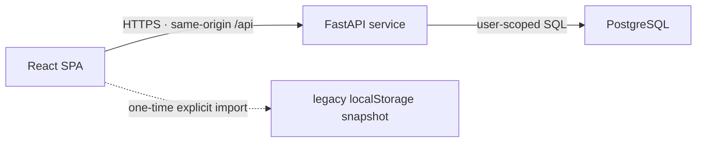

# PLAN for Life OS Production Foundation

**Phase:** B — Plan (read-only; no implementation code changed)
**Date:** 2026-07-21
**Task ID:** PF-01
**Basis HEAD:** `f82ec642747eca051be904a1cccf2ddb83ac1910` (`design-sync-setup`)
**Approved direction:** server-backed; multi-account-ready from the first backend version; local execution is development-only
**Status:** WAITING FOR detailed plan approval

Evidence labels:

- **VERIFIED (HEAD `f82ec64`)** — checked in current HEAD.
- **VERIFIED (WT atop HEAD `f82ec64`)** — checked in the current dirty working tree.
- **ASSUMED** — proposed architecture, pending sign-off.
- **UNKNOWN** — cannot be finalized without owner/infrastructure input.

## 1. Render verdict

Render Free is suitable for a temporary staging deployment, not the final production datastore.

- **VERIFIED (official Render docs, checked 2026-07-21):** a Free web service sleeps after 15 minutes without inbound traffic and takes about one minute to wake: [Deploy for Free — spinning down](https://render.com/docs/free#spinning-down-on-idle).
- **VERIFIED:** the Free web-service filesystem is ephemeral; free instances cannot attach persistent disks: [Deploy for Free — local files](https://render.com/docs/free#local-files-lost-on-redeploy).
- **VERIFIED:** Free Render Postgres is limited to 1 GB, expires after 30 days, and has no backups: [Deploy for Free — Free Postgres](https://render.com/docs/free#free-postgres).
- **VERIFIED:** a Free web service has neither Dashboard shell nor SSH access: [Render SSH access](https://render.com/docs/ssh#compatible-service-types).
- **VERIFIED:** Render provides managed TLS, custom domains, health checks, deploys, and Blueprint infrastructure configuration: [Web Services](https://render.com/docs/web-services#additional-features), [Blueprint spec](https://render.com/docs/blueprint-spec).

**Recommendation:** use Render Free for the first staging proof only. Before storing real finance, profile, or medication data, move PostgreSQL to a paid backed-up plan or deploy the same container stack to a real VPS. Render is a PaaS, not a general-purpose free VPS.

## 2. Scope and target outcome

PF-01 creates a production foundation without changing the product’s visual direction or implementing the pending Calendar/GTD roadmap.

Target topology:



**ASSUMED / recommended stack pending sign-off:**

- frontend: React 18.3.1 initially (matching the current runtime), Vite, mixed JS/TS migration with TypeScript for new contracts and infrastructure;
- backend: Python + FastAPI + Pydantic + SQLAlchemy 2 + Alembic;
- database: PostgreSQL;
- authentication: database-backed opaque sessions in `HttpOnly`, `Secure`, `SameSite=Lax` cookies; Argon2id password hashes; same-origin API;
- packaging: one Docker image builds the React app and serves its static output from FastAPI, avoiding CORS and cross-site-cookie complexity;
- local development: Docker Compose with app + PostgreSQL, using the same migrations and container entrypoint as staging;
- Render: one Web Service plus managed Postgres, described by `render.yaml`.

## 3. Binding task sequence

Each batch is a separate atomic task/commit. Implementation stops after each batch for review. No later batch starts while the preceding batch is red or unapproved.

### Batch 0 — close the existing dirty Batch 1

**Purpose:** prevent unrelated UI work from being silently bundled into production infrastructure.

**VERIFIED (WT atop HEAD `f82ec64`):** ten tracked files already carry `+533/-265`, including the exact production migration hotspots `App.jsx`, `LifeDataProvider.jsx`, `index.html`, `i18n.jsx`, and `styles.css`. `BATCH1-FIX-PROMPT.md:9-15,173-174` explicitly says the work is uncommitted pending QA.

Files already in scope, no new scope added:

- `.DS_Store` — do not stage; restore/removal requires separate owner approval.
- `ui_kits/life-os/App.jsx:9-168,423-447`
- `ui_kits/life-os/GoalsWidget.jsx:1-73`
- `ui_kits/life-os/LifeDataProvider.jsx:26-181,304-316,462-474`
- `ui_kits/life-os/SettingsPage.jsx` — existing changed regions only
- `ui_kits/life-os/Sidebar.jsx` — existing changed regions only
- `ui_kits/life-os/i18n.jsx` — existing changed regions only
- `ui_kits/life-os/index.html:9-47`
- `ui_kits/life-os/pages/RelocatedPages.jsx:21-44`
- `ui_kits/life-os/styles.css` — existing changed regions only

Actions:

1. Map every existing hunk to `BATCH1-FIX-PROMPT.md`; unexpected hunks stop the batch.
2. Verify the eight stated fixes in dark, light, paradise-day, paradise-night × RU/UA.
3. Verify plain URL hides the debug rail and `?debug` shows it.
4. Verify goal creation persists across reload without changing unrelated state.
5. Save Implementation report and commit only the approved Batch 1 files.

Proposed exact commit message: `feat(ui): complete Life OS Batch 1 refinement`

### Batch 1 — reproducible React production build

**Purpose:** remove runtime Babel/CDN React and manual global script ordering while preserving current behavior and visuals.

New files/directories:

- `apps/web/package.json` — pinned frontend dependencies and scripts.
- `apps/web/package-lock.json` — reproducible dependency graph.
- `apps/web/index.html` — Vite entry, pre-paint theme script retained.
- `apps/web/vite.config.js` — build/dev configuration and `/api` development proxy.
- `apps/web/tsconfig.json` — TypeScript for new files with gradual JS interop.
- `apps/web/src/main.jsx` — `createRoot` entry.
- `apps/web/src/App.jsx` — module version of the current root.
- `apps/web/src/app/routes.js` — route registry extracted from `App.jsx:20-34`.
- `apps/web/src/context/LifeDataContext.jsx` — provider module.
- `apps/web/src/context/LocaleContext.jsx` — locale provider/module.
- `apps/web/src/components/**`, `pages/**`, `lib/**`, `data/**`, `profile/**` — the 63 current JS/JSX files migrated with their relative structure.
- `apps/web/src/styles.css`, `apps/web/src/colors_and_type.css` — production stylesheet copies.
- `apps/web/public/assets/**` — logos and scene assets.
- `apps/web/src/test/smoke.test.jsx` — initial mount/route/provider smoke.
- `apps/web/eslint.config.js` — scoped lint configuration.

Existing source treatment:

- `ui_kits/life-os/**` remains unchanged and serves as a visual reference during parity verification.
- No current file is deleted in this batch.
- After production parity, removing the duplicate legacy app is a separate approval/task.

Module-contract changes:

| Before | After |
|---|---|
| `window.LifeDataProvider = LifeDataProvider` | `export function LifeDataProvider(...)` |
| `window.LifeDataContext` | `export const LifeDataContext` |
| `window.LifeMakeT`, `window.LifeLocales` | named exports from `LocaleContext`/i18n module |
| `window.HomePage`, `window.SettingsPage`, etc. | default/named ES module imports |
| 51 browser `text/babel` scripts | one bundled module entry |
| React development CDN runtime | pinned npm dependency compiled to production assets |

Behavior requirement: route IDs, hashes, theme keys, locale copy, component DOM/class names, and CSS output remain behaviorally equivalent.

Proposed exact commit message: `chore(web): add reproducible React production build`

### Batch 2 — multi-account API, authentication, and database

**Purpose:** establish user ownership before any real server data is created.

New files/directories:

- `apps/api/pyproject.toml` — Python dependencies/tool configuration.
- `apps/api/app/main.py` — FastAPI application factory and SPA fallback.
- `apps/api/app/config.py` — environment validation.
- `apps/api/app/db.py` — engine/session lifecycle.
- `apps/api/app/models/{user,session,user_snapshot}.py` — database models.
- `apps/api/app/schemas/{auth,state}.py` — request/response contracts.
- `apps/api/app/routes/{health,auth,state}.py` — HTTP routes.
- `apps/api/app/services/{auth,state}.py` — user-scoped business logic.
- `apps/api/app/security/{passwords,sessions,origin}.py` — hashing, session tokens, origin checks.
- `apps/api/alembic.ini`, `apps/api/alembic/env.py`
- `apps/api/alembic/versions/<revision>_create_accounts_and_snapshots.py`
- `apps/api/tests/test_auth.py`
- `apps/api/tests/test_state_isolation.py`
- `apps/api/tests/test_state_revision_conflict.py`
- `.env.example` — names only; no secrets.

Database migration:

```text
users
  id UUID PK
  email VARCHAR case-insensitive UNIQUE NOT NULL
  password_hash VARCHAR NOT NULL
  is_active BOOLEAN NOT NULL DEFAULT true
  created_at / updated_at TIMESTAMPTZ NOT NULL

sessions
  id UUID PK
  user_id UUID FK users(id) ON DELETE CASCADE NOT NULL
  token_hash VARCHAR UNIQUE NOT NULL
  expires_at / created_at / last_seen_at TIMESTAMPTZ NOT NULL
  index(user_id), index(expires_at)

user_snapshots
  user_id UUID PK/FK users(id) ON DELETE CASCADE
  schema_version INTEGER NOT NULL
  revision BIGINT NOT NULL DEFAULT 1
  payload JSONB NOT NULL
  created_at / updated_at TIMESTAMPTZ NOT NULL
```

API signatures:

```text
GET  /api/healthz
POST /api/v1/auth/bootstrap   {email, password, bootstrap_token} -> SessionUser
POST /api/v1/auth/login       {email, password} -> SessionUser + Set-Cookie
POST /api/v1/auth/logout      -> 204 + expired cookie
GET  /api/v1/auth/me          -> SessionUser
GET  /api/v1/state            -> StateEnvelope{schema_version, revision, payload}
PUT  /api/v1/state            StateReplace{expected_revision, schema_version, payload}
                              -> StateEnvelope | 409 RevisionConflict
```

Bootstrap rule: `POST /auth/bootstrap` succeeds only when the users table is empty and the supplied token matches a secret environment variable. Public registration, password reset email, invitations, teams, roles, and billing are excluded from PF-01.

Snapshot-first rationale: the current provider owns one versioned tree (`LifeDataProvider.jsx:82-109,163-181`), so a per-user JSONB snapshot enables server persistence without simultaneously rewriting every feature domain. Normalizing tasks, transactions, medications, and goals becomes a later domain-by-domain migration. Optimistic `revision` prevents silent last-write-wins overwrites across devices.

Proposed exact commit message: `feat(api): add authenticated multi-account state service`

### Batch 3 — frontend authentication, import, and server synchronization

**Purpose:** make PostgreSQL the source of truth while preserving an explicit route for current local data.

Files to add/modify under `apps/web/src`:

- `api/client.ts` — same-origin JSON client and typed error mapping.
- `api/auth.ts` — `bootstrap/login/logout/me` calls.
- `api/state.ts` — `getState/replaceState` calls.
- `repositories/stateRepository.ts` — repository contract.
- `repositories/serverStateRepository.ts` — revision-aware API implementation.
- `repositories/legacyLocalImport.ts` — read-only one-time reader of `lifeOsState`.
- `context/AuthContext.jsx` — boot/auth/login/logout states.
- `context/LifeDataContext.jsx` — asynchronous server load/save/conflict handling.
- `pages/LoginPage.jsx` — private entry surface.
- `components/StateImportPrompt.jsx` — explicit preview/confirm import; never automatic.
- `components/SyncStatus.jsx` — saving/saved/offline/conflict/error state.
- `SettingsPage.jsx` — server export and destructive reset semantics.
- `App.jsx` — auth/loading/error gates before route shell.
- i18n dictionaries — RU+UA strings for auth/import/sync/error states.

Function signatures:

```ts
// Before: synchronous browser snapshot
LifeStorage.load(): object | null
LifeStorage.save(state): void
LifeStorage.clear(): void

// After: server repository
interface StateRepository {
  load(): Promise<StateEnvelope>;
  replace(payload: LifeOsState, expectedRevision: number): Promise<StateEnvelope>;
  reset(expectedRevision: number): Promise<StateEnvelope>;
}

readLegacyLocalState(): LifeOsState | null; // read-only import bridge
```

Provider behavior:

1. Resolve authenticated user.
2. Fetch that user’s snapshot.
3. If server snapshot is empty and a legacy local snapshot exists, show explicit import prompt.
4. Never delete local data automatically; mark successful import locally only after server acknowledgement.
5. Queue one save at a time; send the last acknowledged revision.
6. On `409`, stop writes, show conflict UI, and require reload/explicit resolution.
7. On network failure, keep unsaved in-memory state visible and show status; do not claim it is persisted.

Proposed exact commit message: `feat(sync): persist Life OS state per account`

### Batch 4 — local container and Render staging deployment

New files:

- `Dockerfile` — multi-stage frontend build + backend runtime.
- `.dockerignore`
- `docker-compose.yml` — app + PostgreSQL for local development.
- `render.yaml` — Web Service and database configuration, health check, environment references.
- `scripts/entrypoint.sh` — migration then server start for single-instance staging.
- `docs/deployment.md` — local commands, Render setup, bootstrap, upgrade-to-production gate, backup/restore.

Deployment layout:

- one public Render Web Service serves `/api/*` and the built SPA on the same origin;
- Postgres is separate and connected through `DATABASE_URL`;
- frontend static files never contain database/auth secrets;
- `/api/healthz` is the Render health-check path;
- free staging uses one instance and may run `alembic upgrade head` in the entrypoint;
- paid/multi-instance production moves migrations to Render’s pre-deploy command or an explicit release job.

Production gate: do not import real user data while using Free Render Postgres. Upgrade to a database plan with backups or deploy PostgreSQL to an approved VPS with tested backup/restore first.

Proposed exact commit message: `chore(infra): add Render staging deployment`

## 4. Blast-radius and caller matrix

### 4.1 `LifeDataProvider` / `LifeDataContext`

Complete grep inventory: exactly 16 files reference `LifeDataContext` in the current UI kit:

1. `App.jsx`
2. `CalendarView.jsx`
3. `LifeDataProvider.jsx`
4. `SettingsPage.jsx`
5. `components/ActivityTimeline.jsx`
6. `pages/FinancesPage.jsx`
7. `pages/HomePage.jsx`
8. `pages/MedicationsPage.jsx`
9. `pages/RelocatedPages.jsx`
10. `pages/medications/GlobalJournal.jsx`
11. `pages/medications/MedCard.jsx`
12. `pages/medications/MedConfigDrawer.jsx`
13. `pages/medications/MedDetailPage.jsx`
14. `pages/medications/PharmNotes.jsx`
15. `pages/medications/RefillModal.jsx`
16. `pages/medications/TakeDoseModal.jsx`

| Caller group | Current behavior | Planned delta |
|---|---|---|
| `App.jsx` | provider mounts synchronously from local data | auth and async boot gate; route UI mounts only after state is resolved |
| Calendar/Home/Finance/Goals | reads `data.state`, invokes existing mutations | provider value shape retained; no domain behavior change |
| Medication components | reads state and invokes medication/dose/note mutations | provider value shape retained; saves become server-acknowledged |
| ActivityTimeline | reads activity log | unchanged rendering; state source becomes server snapshot |
| Settings | synchronous JSON export/reset/history prune | export remains available; reset becomes confirmed async server mutation |
| Provider itself | saves every state change to throttled localStorage | delegates to revision-aware repository and exposes sync state |

### 4.2 `LifeStorage`

Complete current caller inventory is exactly three calls, all in `LifeDataProvider.jsx`: load at `:187`, save at `:194`, clear at `:458`. After Batch 3 these calls become exactly zero in production provider code. `legacyLocalImport.ts` is the sole permitted reader of `lifeOsState`.

### 4.3 Locale context

Complete grep finds 41 files referencing `LifeLocaleContext`. Batch 1 changes only import wiring, not the context value or translations. Every caller must render in RU and UA without key fallback.

## 5. State lifecycle after PF-01

| Event | Required behavior |
|---|---|
| First account | one-time bootstrap token; creates user, session, empty snapshot |
| Login | opaque token stored only as hash server-side; browser receives secure cookie |
| Initial load | auth → state fetch → validated schema → render |
| Mutation | existing synchronous UI mutation → queued PUT with expected revision → saved indicator after acknowledgement |
| Rapid mutations | coalesce locally but preserve latest payload; never issue concurrent replacements for the same revision |
| Double-tap | UI mutation semantics remain current; transport sends a single coalesced snapshot; domain idempotency remains a later normalization concern |
| Network loss | in-memory change remains visible and explicitly unsaved; no false “saved” state |
| Two-device race | stale revision receives 409; writes stop until explicit reload/resolution |
| Browser restart | reload server snapshot; legacy local state is never auto-imported |
| Corrupt server payload | API schema validation fails closed; UI shows recovery/export path, never seeds over existing server state |
| User logout | in-memory private state cleared before showing login |
| Account deletion | not implemented in PF-01; no false control exposed |
| Old web + new data | state `schema_version` checked; unsupported newer versions fail closed |
| New web + old data | frontend migration function upgrades a copied payload before save; original revision retained until successful PUT |

## 6. Invariants checklist

- **Multi-account isolation — mandatory:** every snapshot and session operation obtains `user_id` exclusively from the authenticated session, never from request JSON. Cross-user access must return not-found/unauthorized without revealing existence.
- **Source of truth — mandatory:** after confirmed import, server snapshot is authoritative. `localStorage.lifeOsState` is read-only legacy input, not a fallback write target.
- **No silent overwrite — mandatory:** revision mismatch returns 409; client cannot retry with a new revision automatically.
- **Secrets — mandatory:** no password, session token, database URL, or bootstrap token is compiled into frontend assets or committed.
- **Activity log — preserved:** existing activity append semantics (`LifeDataProvider.jsx:196-209`) remain unchanged in PF-01.
- **Visual/theme invariants — preserved:** current route hashes, CSS class names, dark/light/paradise behavior, RU/UA copy, and stakes-color discipline do not change during module migration.
- **Billing — VERIFIED N/A:** grep across current application JS/JSX finds no credits/deduct/billing service. PF-01 adds no payments.
- **Status state-machine — VERIFIED N/A:** PF-01 does not implement the planned task-status/GTD changes.
- **FSM keys — VERIFIED N/A:** this is React context/local state, not aiogram FSM; grep finds no application FSM.
- **Telegram `callback_data ≤64B` — VERIFIED N/A:** no Telegram bot or callback data exists in application code.

## 7. Verification plan and expected gates

### Batch 0

- `git diff --check` → exactly 0 errors.
- Browser matrix → 4 theme/scene modes × 2 locales = exactly 8 visual combinations.
- Plain URL → debug rail absent; `?debug` → rail present.
- Add one goal → reload → exactly one new persisted goal, unrelated state unchanged.
- No Docker, pytest, bot, API, or external service command.

### Batch 1

- `npm ci` → lockfile-resolved install succeeds.
- `npm run lint` → 0 new errors.
- `npm run build` → production build succeeds.
- `rg 'type="text/babel"' apps/web` → exactly 0 hits.
- `rg 'react\.development|babel\.min\.js' apps/web` → exactly 0 hits.
- `rg 'window\.(Life|LIcons)' apps/web/src` → exactly 0 hits.
- Route smoke → exactly 15 registered routes resolve.
- Parity smoke → Home, Tasks, Finance, Medication detail, Settings across dark/light/paradise and RU/UA.

### Batch 2

- `python -m compileall apps/api/app` → success.
- `ruff check apps/api/app apps/api/tests` → 0 new errors.
- `python -c "from app.main import create_app"` from API root → success.
- `alembic heads` and `alembic branches` raw output saved; expected exactly one head and no unexpected branch.
- `alembic upgrade head --sql` → emits exact `CREATE TABLE` statements for `users`, `sessions`, `user_snapshots`, their FKs, uniques, and indexes.
- Static query audit → every state/session query receives authenticated `user_id`.
- Per current repository rules, Codex does not run pytest; targeted test commands are documented for user execution.

### Batch 3

- Frontend build/lint succeeds.
- `rg 'localStorage.*lifeOsState' apps/web/src` → exactly 1 permitted hit in `legacyLocalImport.ts`.
- Cross-account tests: user A cannot read/overwrite user B; stale revision returns 409; logout clears private UI state.
- Import test: local snapshot remains untouched until server PUT succeeds.
- Neighbor regression: theme/sidebar preferences still survive reload without being stored in the server snapshot unless explicitly approved later.

### Batch 4

- Dockerfile/config syntax checks only by Codex under current rules; Docker build/run remains user-run unless separately authorized.
- `render.yaml` validation against current Blueprint fields.
- Staging smoke: health, bootstrap, login, state import, reload, logout/login, second-user isolation, revision conflict.
- Deployment HEAD/build identifier captured; no production-data claim from a Free database.

## 8. Browser tests («Ціль / Кроки / Очікую»)

Telegram BOT TESTS are **N/A**: `ui_kits/life-os` contains no aiogram bot, handlers, or callback data. Equivalent browser/API scenarios:

1. **Ціль:** зберегти наявний UI після module migration.
   **Кроки:** відкрити Home → Tasks → Finance → Medications → Settings у 8 theme/locale комбінаціях.
   **Очікую:** ті самі маршрути, тексти, дані, теми й інтеракції; console без runtime errors.

2. **Ціль:** довести account isolation.
   **Кроки:** створити A і B; імпортувати різні snapshots; повторити GET/PUT з обома sessions.
   **Очікую:** кожен бачить лише власний стан; жоден request field не дозволяє підмінити owner.

3. **Ціль:** довести безпечний deploy race.
   **Кроки:** два браузери завантажують revision N; перший зберігає N+1; другий намагається зберегти N.
   **Очікую:** другий отримує 409 і conflict UI; дані першого не перезаписані.

4. **Ціль:** neighbor regression локальних налаштувань.
   **Кроки:** змінити theme/sidebar, перелогінитися, перезавантажити сторінку.
   **Очікую:** UI preferences працюють як раніше; приватний domain state завантажується із сервера.

## 9. Rollback

- Batch 0 is isolated in its own commit and can be reverted without touching production foundation.
- Batch 1 creates `apps/web` while preserving `ui_kits/life-os`; legacy app remains the visual rollback/reference.
- Batch 2 database migration is additive. Before real data, rollback is migration downgrade/drop. After real data, never drop tables; revert application and retain database.
- Batch 3 can be reverted to the legacy app without deleting server snapshots. No automatic local-state deletion occurs.
- Batch 4 staging resources can be removed from Render without affecting Git history; any database containing real data requires export/backup before removal.

## 10. BINDING not-touched list

PF-01 does not:

- implement Calendar cube, GTD statuses, Clarify funnel, Weekly Review, contexts, or Sprint 4 finance features;
- change medication calculations, finance inclusion rules, calendar aggregation, task semantics, or goal semantics;
- redesign the interface or alter CSS class contracts beyond import relocation;
- add organizations, teams, roles, invitations, public registration, billing, subscriptions, password-reset email, or social login;
- normalize each domain into separate relational tables yet;
- delete the legacy UI kit, preview specimens, design-sync files, screenshots, or user-owned working-tree artifacts;
- deploy real private data to Free Render Postgres;
- push/deploy any batch before its static gates and owner review pass.

## 11. Consolidated SIGN-OFF ITEMS

1. **Stack:** approve React 18 + Vite mixed JS/TS, FastAPI, SQLAlchemy/Alembic, PostgreSQL. Recommendation: approve; it minimizes visual churn and gives explicit API/schema boundaries.
2. **Snapshot-first persistence:** approve `user_snapshots` JSONB + optimistic revision as v1, with domain normalization later. Recommendation: approve; rewriting every domain now would delay server-backed delivery substantially.
3. **Repository layout:** approve new `apps/web` and `apps/api`, preserving `ui_kits/life-os` until parity. Recommendation: approve; it protects the design reference and current dirty work.
4. **Dirty Batch 1:** approve finishing/QA/committing it before production work. Recommendation: approve; the current changes overlap core migration files.
5. **Auth scope:** approve bootstrap + login/logout/session only; no public signup/reset/invites in PF-01. Recommendation: approve for first private deployment.
6. **Deployment topology:** approve one same-origin Docker Web Service + PostgreSQL. Recommendation: approve; simpler cookie security and one deployable artifact.
7. **Render:** approve Free only for staging and require paid backed-up Postgres or a real VPS before real data. Recommendation: approve; Render explicitly says Free is not for production.
8. **Instruction repair:** approve replacing the mismatched `AGENTS.md`/`CLAUDE.md` in a separate atomic housekeeping task before Batch 1 implementation. Recommendation: approve; current instructions point to another repository/VPS.
9. **Commit messages:** approve the four exact messages listed above. No commit/push/deploy occurs until the relevant batch completes.

WAITING FOR: approval of this Plan and the nine sign-off items before Phase C Batch 0.
