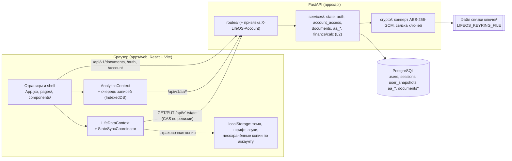
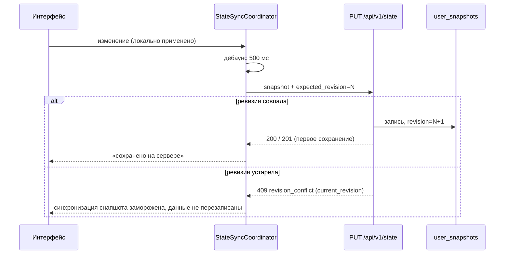

# JENKIN — обзор продукта и архитектуры

> **Состояние документа.** Сверено с кодом ветки `integration/jenkin-combined-20261001`
> на коммите `ca5408c` (1 октября 2026 г.), с манифестами зависимостей и проектными
> документами. Ветка **не влита в `main`** и **нигде не развёрнута**. `origin/main`
> (`5e858bb`) не содержит работ JENKIN. Если код и этот документ расходятся, прав код;
> изменяемые факты (SHA, число тестов, статусы веток) проверяйте заново.
>
> Документ для нового разработчика, соавтора или технически заинтересованного читателя.
> Операционный контекст для агентов и история решений — в
> [`LIFEOS_MASTER_CONTEXT.md`](../../LIFEOS_MASTER_CONTEXT.md); правила работы в
> репозитории — в [`AGENTS.md`](../../AGENTS.md).

## Содержание

1. [Что такое JENKIN](#1-что-такое-jenkin)
2. [Для кого и в каких ситуациях](#2-для-кого-и-в-каких-ситуациях)
3. [Какие задачи решает и принципы продукта](#3-какие-задачи-решает-и-принципы-продукта)
4. [Модули и их связи](#4-модули-и-их-связи)
5. [Сквозные сценарии](#5-сквозные-сценарии)
6. [Что реализовано, а что нет: таблица статусов](#6-что-реализовано-а-что-нет-таблица-статусов)
7. [Архитектура фронтенда и бэкенда](#7-архитектура-фронтенда-и-бэкенда)
8. [Технологический стек](#8-технологический-стек)
9. [Данные: владение, хранение, синхронизация, ревизии, конфликты](#9-данные-владение-хранение-синхронизация-ревизии-конфликты)
10. [Аутентификация, изоляция аккаунтов, сессии, восстановление](#10-аутентификация-изоляция-аккаунтов-сессии-восстановление)
11. [Шифрование, ключи, экспорт, удаление, резервные копии](#11-шифрование-ключи-экспорт-удаление-резервные-копии)
12. [Локальный запуск и будущий хостинг](#12-локальный-запуск-и-будущий-хостинг)
13. [Финансы и путь «документ → кредит»](#13-финансы-и-путь-документ--кредит)
14. [Версии и история обновлений](#14-версии-и-история-обновлений)
15. [Разработка и проверка](#15-разработка-и-проверка)
16. [Ссылки на подробную документацию](#16-ссылки-на-подробную-документацию)

---

## 1. Что такое JENKIN

JENKIN — личная «операционная система» для повседневной жизни: задачи и
делегированное, календарь, заметки, проекты и цели, финансы и финансовые документы,
здоровье и препараты, профиль. Это одно приложение, где у человека собраны дела,
деньги и важные бумаги, а не набор разрозненных сервисов.

**Почему он существует.** Владелец проекта хочет один спокойный, честный инструмент,
который помогает не терять дела и обязательства, видеть реальное состояние денег и
документов и не подменяет данные красивыми, но выдуманными цифрами.

**Имя.** JENKIN — видимое название продукта. Внутри кода по-прежнему встречается
**LifeOS**: пакет `@life-os/web`, переменные `LIFEOS_*`, ключи `localStorage`
`lifeOs*`, база IndexedDB `lifeos-adaptive-analytics`, имена файлов экспорта
`lifeos-*`, репозиторий `yurafreedom/LifeOS`. Это сделано намеренно ради
совместимости с сохранёнными данными, экспортами и сессиями; техническое
переименование планируется отдельно и только явным решением владельца.

## 2. Для кого и в каких ситуациях

- **Основной пользователь — владелец проекта.** Приложение изначально строилось
  под одного человека, но архитектура уже многоаккаунтная: у каждого аккаунта свои
  данные, а владелец (`owner`) может приглашать других участников (`member`).
- **Контексты использования:** утренний просмотр дня (главная, «Задачи» на сегодня,
  календарь), быстрый захват мысли в «Заметки» и её разбор (Clarify), отслеживание
  делегированного («Ожидание»), учёт расходов вручную, хранение финансовых
  документов (договоры, графики платежей) в зашифрованном виде, ведение профиля и
  препаратов.
- **Устройства:** браузер на компьютере и телефоне. Макет проверяется на ширинах
  1440, 1024, 768, 390 и 320 px; на узких экранах есть нижняя навигация.
- **Языки интерфейса:** русский (основной) и украинский.

## 3. Какие задачи решает и принципы продукта

Задачи:

- не терять дела: быстрый захват → разбор → задача, проект, ожидание или справочник;
- видеть «сегодня» и «просрочено» по реальной дате задачи по киевскому времени;
- помнить, кого и чего ждёшь (делегированное с исходом: получено, отменено,
  превращено в задачу);
- хранить финансовые документы так, чтобы утечка одной базы данных их не раскрыла;
- в перспективе — превращать загруженный кредитный документ в понятный, проверенный
  пользователем кредит с графиками и напоминаниями (см. §13).

Принципы, которые соблюдаются в коде и документах:

- **Честность данных.** Отсутствие данных — не ноль. Новые аккаунты начинаются
  пустыми; неподключённые интеграции (Telegram, monobank, уведомления) так и
  помечены; рассчитанное значение никогда не выдаётся за баланс кредитора.
- **Факт ≠ прогноз, проект ≠ цель.** Эти различия заморожены как инварианты.
- **Ничего не придумывать.** Не выдумывать даты, версии, суммы и семантику; спорные
  решения выносятся владельцу.
- **Сервер — источник истины** для рабочего состояния; локальная копия в браузере —
  удобство и страховка, а не хранилище.
- **Спокойный интерфейс.** Один акцентный цвет для действительно важного, никаких
  декоративных дашбордов. Визуальная система описана в
  [`docs/design-system/README.md`](../design-system/README.md) (исходная
  спецификация) и в [`design-references/jenkin-branding/`](../../design-references/jenkin-branding/)
  (утверждённый логотип Editorial и шрифт DejaVu Sans).

## 4. Модули и их связи

| Модуль | Что делает сейчас | Где хранится |
|---|---|---|
| Главная | приветствие, сводки по реальным данным снапшота | снапшот |
| Заметки + Clarify | быстрый захват и разбор: задача, отложенная задача, ожидание, проект, справочник, удаление | снапшот |
| Задачи | фильтр с точными счётчиками, сортировка, даты/время, «сегодня»/«просрочено», перенос, закрытие без выполнения | снапшот |
| Ожидание (Waiting For) | делегированное: получено / отменено / превращено в задачу, закрытые отдельно, возврат | снапшот |
| Календарь | годы → месяцы → дни (раскладки A/B) → подробности дня, история; показывает задачи (событий как отдельной сущности нет) | снапшот (задачи) |
| Проекты, цели | проекты с прогнозом и жизненным циклом; цели — добавление и просмотр | снапшот |
| Привычки, здоровье, препараты, собака | частично: отметка привычек, приём препаратов; создать привычку, препарат или профиль собаки в новом аккаунте нельзя; «Здоровье» — заготовка | снапшот |
| Финансы → операции | ручной учёт расходов по категориям, учёт/исключение из итогов; бюджетов нет | снапшот (+ зеркало в аналитике) |
| Финансы → документы | PDF/JPEG/PNG, версии, названия и заметки, скачивание, удаление | зашифрованные таблицы документов |
| Аналитика (Adaptive Analytics) | история метрик, обзоры, эксперименты, обзор системы; **за флагом сборки** `VITE_LIFEOS_ANALYTICS_ENABLED` (в обычной сборке выключено, лаунчер предпросмотра включает) | реляционные таблицы `aa_*` |
| Настройки | аккаунт, безопасность, категории, оформление (тема, сцена, язык, шрифт), звуки, экспорт, хранение аналитики, **о JENKIN**, опасная зона | сервер + настройки устройства |
| История обновлений | страница `#/updates` из канонического файла записей | файл в репозитории |

Связи: «Заметки» через Clarify создают задачи, ожидания, проекты и справочник;
задачи с датой видны в «Календаре» и в «Задачах»; финансовые операции зеркалируются
в аналитику; документы в будущем станут источником для кредитов (§13).

## 5. Сквозные сценарии

**Утро.** Пользователь открывает JENKIN → главная показывает день → «Задачи» с
фильтром «сегодня» (по дате задачи по Киеву) → просроченную задачу переносит на
завтра прямо из карточки → изменение сохраняется в снапшот на сервере, индикатор
синхронизации показывает «сохранено на сервере».

**Захват и разбор.** Мысль записана в «Заметки» → Clarify → «делегировать» →
запись в «Ожидании» с именем человека → когда ответ пришёл, запись отмечается
полученной или превращается в обычную задачу; закрытая запись остаётся в истории.

**Документ.** «Финансы → документы» → загрузка PDF кредитного договора с названием
и заметкой → сервер проверяет тип по содержимому, шифрует файл и описание, хранит
версии → позже можно загрузить новую версию или скачать файл. **Чего не происходит:**
условия не извлекаются, кредит не создаётся, графики и напоминания не появляются.

**Безопасность аккаунта.** Пользователь меняет пароль → другие сессии завершаются;
забыл пароль → письмо с одноразовой ссылкой на час (если на сервере настроена почта);
в списке сессий завершает чужое устройство.

**Две вкладки, два аккаунта.** В одной вкладке открыт аккаунт A, в другой вошли как
B → первая вкладка обнаруживает смену, не смешивает данные, показывает отдельный
экран; несохранённые правки A сохраняются отдельно и будут предложены только A.

## 6. Что реализовано, а что нет: таблица статусов

Статусы:
**реализовано в этой ветке** — есть в `integration/jenkin-combined-20261001` (не в `main`);
**реализовано в другой ветке, не интегрировано** — на момент проверки **таких нет**:
все удалённые ветки JENKIN уже входят в эту ветку;
**запланировано** — есть план или решение, кода нет;
**заблокировано извне** — нужны внешние условия (ключи, договоры, провайдеры, решения владельца об инфраструктуре).
Для того, чего нет ни в коде, ни в плане, указано «не запланировано» или «не планируется».

| Возможность | Статус | Примечание |
|---|---|---|
| Имя JENKIN, логотип Editorial, значок вкладки | реализовано в этой ветке | технические идентификаторы остаются LifeOS |
| Темы: системная, тёмная, светлая, paradise (день/ночь) | реализовано в этой ветке | системная — по умолчанию |
| Необязательный шрифт DejaVu Sans | реализовано в этой ветке | настройка устройства (`lifeOsFont`) |
| RU / UK интерфейс | реализовано в этой ветке | выбор языка не сохраняется между перезагрузками |
| Задачи, Ожидание, Clarify, даты и перенос | реализовано в этой ветке | |
| Календарь Years → Months → Days → Day details | реализовано в этой ветке | только задачи; событий нет |
| События (Events) как отдельная сущность | запланировано | с обязательным правилом для перехода на летнее/зимнее время |
| Отдельные «Входящие» и умный захват | запланировано | сейчас роль входящих играют «Заметки» + Clarify |
| Многоаккаунтность, привязка запросов к аккаунту | реализовано в этой ветке | заголовок `X-LifeOS-Account` |
| Роли owner/member, приглашения, смена пароля, восстановление, подтверждение почты, сессии, ограничение попыток, журнал безопасности | реализовано в этой ветке | доставка писем в продакшене — заблокировано извне (SMTP) |
| Ключи доступа (passkeys / WebAuthn), TOTP | запланировано | в коде нет |
| Дія / id.gov.ua, BankID | заблокировано извне | в коде нет |
| Зашифрованные документы (S2) | реализовано в этой ветке | включение в продакшене — заблокировано извне (хранение ключей, E-06; ёмкость, E-11) |
| Шифрование снапшота, аналитики, копий в браузере | запланировано | план предложен, не реализован |
| Ручной учёт расходов | реализовано в этой ветке | подписи «$», а аналитика пишет UAH — несоответствие известно (F1) |
| Финансовые обязательства и кредиты (F1 / L1: таблицы `fin_*`, ручная форма как запасной путь) | запланировано | следующий срез |
| Расчётный движок кредитов (L2) | реализовано в этой ветке | только серверная библиотека: нет таблиц, API и экранов |
| Приём документов: извлечение → редактируемая проверка (L3) | запланировано | |
| Подтверждённый кредит, графики, диаграммы (L4) | запланировано | |
| Извлечение с помощью ИИ (L5) | заблокировано извне | |
| Напоминания (L6), выписки и кредитные истории (L7), адаптер для обзора системы (L8) | запланировано | |
| Подключение банков (monobank, PrivatBank) | заблокировано извне | в настройках помечено «не подключено» |
| Telegram-бот, уведомления | не запланировано | плана нет; в настройках помечено «не подключено» |
| Аналитика (Adaptive Analytics, срезы 0–8) | реализовано (влито в `main` ранее) | за флагом сборки |
| Страница истории обновлений `#/updates`, «Настройки → о JENKIN» | реализовано в этой ветке | §14 |
| Локальный предпросмотр одной командой | реализовано в этой ветке | инструмент разработчика (§12) |
| Публичный хостинг, домен, TLS | запланировано | предлагаемый адрес не настроен (§12) |
| Сквозное (end-to-end) шифрование / zero-knowledge | не планируется в текущей архитектуре | сервер может расшифровать документы |

## 7. Архитектура фронтенда и бэкенда



**Фронтенд** (`apps/web/src`): одностраничное React-приложение с хеш-маршрутами
(`#/tasks`, `#/calendar/2026-10`, `#/finances/documents`, `#/updates` …;
`app/routes.js`, `app/routeRegistry.js`). Тяжёлые страницы грузятся лениво
(`app/lazyRoutes.jsx`). Состояние приложения — `LifeDataContext` поверх
`StateSyncCoordinator`; аналитика — отдельный `AnalyticsContext` с очередью записей
в IndexedDB. Чистая доменная логика — в `domain/` (задачи, ожидание, Clarify,
календарь, черновики редакторов, записи обновлений). Стили — упорядоченный манифест
слоёв `styles.css` (порядок закреплён тестом) плюс `brand.css`.

**Бэкенд** (`apps/api/app`): FastAPI-приложение из фабрики `create_app()`
(`uvicorn --factory app.main:create_app`). Направление зависимостей:
`routes/ → services/ → analytics/ → models/`. Маршруты: здоровье, аутентификация,
состояние, аккаунт и безопасность, экспорт, документы, аналитика (`/api/v1/aa/*`).
Миграции Alembic, линейная цепочка, голова `20261001_0012`.

**Границы модулей** и «куда идти, чтобы изменить X» — в
[`Outputs/architecture/module-boundaries.md`](../../Outputs/architecture/module-boundaries.md).
Это рабочая карта архитектуры; здесь она не дублируется.

## 8. Технологический стек

Проверено по `apps/web/package.json`, `apps/api/pyproject.toml` и `apps/api/requirements.lock`.

| Слой | Технологии и версии |
|---|---|
| Фронтенд, runtime | React 18.3.1, React DOM 18.3.1 (других runtime-зависимостей нет) |
| Фронтенд, разработка | Vite 8.1.5, Vitest 4.1.10, TypeScript 7.0.2 (проверка типов, смешанный JS/TS), ESLint 10.7.0, fake-indexeddb 6 |
| Node.js | в манифестах не закреплён; инструкции предпросмотра требуют Node ≥ 20.19 |
| Бэкенд | Python 3.11 (`>=3.11,<3.12`), FastAPI 0.139.2, Starlette 1.3.1, SQLAlchemy 2.0.51, Alembic 1.18.5, psycopg 3.3.4, Pydantic 2.13.4 + pydantic-settings 2.14.2, Uvicorn 0.51.0, email-validator 2.3.0 |
| Безопасность | пароли — Argon2 (pwdlib 0.3.0 + argon2-cffi 25.1.0); шифрование — cryptography 50.0.2 (AESGCM); проверка PDF — pypdf 6.19.0 |
| База данных | только PostgreSQL (`postgresql+psycopg://`) |
| Тесты и качество | pytest 9.1.1, httpx 0.28.1, Ruff 0.15.22 |
| CSS | собственная дизайн-система на CSS custom properties, без UI-фреймворка |

## 9. Данные: владение, хранение, синхронизация, ревизии, конфликты

**Гибридная модель.**

1. **Снапшот** (`user_snapshots`, одна строка на пользователя): изменяемое текущее
   состояние — профиль, задачи, ожидание, заметки, проекты, цели, привычки,
   препараты, финансовые операции, справочник, журнал активности. JSON-полезная
   нагрузка, `schema_version` = 2, ревизия.
2. **История аналитики** (`aa_*`, ~29 таблиц): неизменяемые/версионируемые факты —
   измерения, ожидания, прогнозы, базовые линии, цели, наблюдения, обзоры,
   эксперименты, хранение истории. Снапшот не используется как историческое
   свидетельство.
3. **Документы** (`documents`, `document_versions`, `document_blobs`): зашифрованное
   содержимое и описание (§11).

**Владение.** Каждая строка принадлежит пользователю; права определяет серверная
сессия. Заголовок `X-LifeOS-Account` — не авторизация, а защита от смешивания
аккаунтов: если клиент ожидает аккаунт A, а сессия принадлежит B, запрос отклоняется
(`409 session_user_mismatch`) до любого чтения или записи; без заголовка — `428`.



**Синхронизация и конфликты.**

- Запись снапшота — compare-and-swap по ревизии. Конфликт `409` замораживает
  синхронизацию снапшота и не трогает очередь аналитики.
- Редакторы задач хранят исходное состояние: отправляются только реально изменённые
  поля; если то же поле изменилось на сервере, пользователь выбирает «взять
  сохранённое» или «оставить моё».
- Аналитика пишется через долговременную очередь в IndexedDB (повторы,
  карантин записей без владельца, привязка повтора к владельцу записи).
- Несохранённые правки при истечении сессии, смене аккаунта или выходе хранятся в
  `localStorage` **отдельно по аккаунту** и предлагаются обратно только ему (с CAS).
- Старые данные `lifeOsState` из браузера импортируются только после подтверждения
  владения.

**Чего нет:** офлайн-режима как продукта, слияния конфликтов, синхронизации между
устройствами в реальном времени (свежие данные приходят при загрузке/фокусе).

## 10. Аутентификация, изоляция аккаунтов, сессии, восстановление

- **Сессии на сервере:** таблица `sessions` хранит хеш токена (SHA-256), срок,
  последнюю активность и метку устройства. Cookie `lifeos_session` (в продакшене
  `__Host-lifeos_session`), `HttpOnly`, `SameSite=Lax`; срок 30 дней.
- **Первый вход:** аккаунт владельца создаётся через `POST /api/v1/auth/bootstrap`
  с одноразовым bootstrap-токеном (≥ 32 символов) только на пустой базе.
- **Роли и приглашения:** `owner` / `member`; приглашения выдаёт только владелец,
  они привязаны к почте, одноразовые, действуют 7 дней. Принятие приглашения
  подтверждает почту, только если письмо действительно было отправлено.
- **Пароли:** Argon2; смена пароля завершает остальные сессии.
- **Восстановление:** общий ответ `202` (не раскрывает, есть ли аккаунт), одноразовая
  ссылка на 1 час, после сброса завершаются все сессии. Подтверждение почты — 24 часа.
- **Ограничение попыток:** атомарные счётчики в БД (`auth_throttle`) для входа,
  восстановления, смены пароля и токенов.
- **Журнал безопасности:** события без секретов, хранение 365 дней, входят в экспорт
  и удаляются вместе с аккаунтом.
- **Почта:** `LIFEOS_MAIL_BACKEND` = `disabled` (по умолчанию) | `memory` (тесты) |
  `file` (разработка, письма — файлы `.eml`) | `smtp`. **SMTP не настроен:** нужны
  реальный SMTP-сервер, отправитель и публичный HTTPS-адрес приложения. Владение
  доменом само по себе почту не настраивает.

**Ограничения:** нет passkeys/TOTP, нет входа через Дію/BankID; без настроенной
почты восстановление и приглашения по письму в продакшене не работают.

## 11. Шифрование, ключи, экспорт, удаление, резервные копии

**Что это.** Серверное шифрование документов «в покое» — **не сквозное и не
zero-knowledge**. Утечка одной только базы данных не раскрывает содержимое
документов, имена файлов, названия и заметки. Работающий API (или любой, у кого есть
связка ключей) может их расшифровать.

- **Схема:** конверт AES-256-GCM — случайный ключ данных (DEK) на каждую версию и
  каждую запись описания, обёрнутый версионируемым ключом шифрования ключей (KEK);
  96-битные случайные nonce; AAD привязывает владельца, объект и назначение.
- **Ключи:** JSON-связка ключей, файл `LIFEOS_KEYRING_FILE` с правами `0600`/`0400`.
  Документы выключены по умолчанию (`LIFEOS_DOCUMENTS_ENABLED=false`); при включении
  без исправной связки ключей API не стартует — без «тихого» хранения открытым текстом.
- **В открытом виде остаются:** идентификаторы, владелец, номера версий, проверенный
  тип, размер, даты, ревизия, идентификатор KEK; **а также снапшоты, таблицы
  аналитики, данные в браузере и временный файл общего экспорта**. План их защиты
  предложен, но не реализован.
- **Инструменты:** `python -m app.cli keyring-generate | keyring-add-key |
  keyring-import-key | keyring-activate | keyring-check | keyring-retire-key`,
  `documents-rotate` (перешифровка ключей, возобновляемая), `documents-verify [--deep]`.
- **Экспорт:** общий архив аккаунта `GET /api/v1/export`; отдельный архив
  расшифрованных документов `GET /api/v1/export/documents` (потоково, без временного
  файла). Файлы в архиве **не зашифрованы**.
- **Удаление:** удаление документа убирает строки, обёрнутые ключи и содержимое в
  одной транзакции; удаление аккаунта каскадно удаляет всё, включая документы.
- **Резервные копии:** дамп БД содержит шифротекст без ключей — храните связку ключей
  отдельно от дампов; не уничтожайте KEK, пока живы зависящие от него копии; копии,
  сделанные до удаления, всё ещё содержат шифротекст (мгновенного
  криптографического стирания нет); потеря KEK делает данные нечитаемыми навсегда.
  Подробно — [`Outputs/Runbooks/jenkin-document-keys-runbook.md`](../../Outputs/Runbooks/jenkin-document-keys-runbook.md).

## 12. Локальный запуск и будущий хостинг

**Локально (то, что работает сейчас).**

```bash
# предпросмотр одной командой: production-сборка + реальный API
./scripts/preview.sh                       # база lifeos_preview
./scripts/preview.sh --db-suffix personal  # база lifeos_preview_personal
./scripts/preview.sh status | stop | logs
```

- Адреса: веб `http://127.0.0.1:4710/`, API `127.0.0.1:8710` (порты меняются
  флагами `--port` / `--api-port`).
- Лаунчер работает только с базами `lifeos_preview[_<суффикс>]`, перед миграцией
  непустой базы делает `pg_dump` и копию связки ключей; приватное состояние — в
  `~/.jenkin-preview`; письма пишутся в файлы, ничего не отправляется.
- Подробно: [`scripts/preview/README.md`](../../scripts/preview/README.md).
- Ручной режим разработки: Vite dev `127.0.0.1:5173` (проксирует `/api` на
  `127.0.0.1:8000`), API — `uvicorn --factory app.main:create_app` с
  `LIFEOS_DATABASE_URL` и `LIFEOS_BOOTSTRAP_TOKEN`. Тесты бэкенда — только на базе
  `lifeos_test` (или одноразовой `*_test`).

**Будущий хостинг (не реализовано).**

- Владелец владеет доменом `sachenkolabs.tech`. **Предлагаемый** адрес приложения —
  `https://jenkin.sachenkolabs.tech`. Это предложение, а не работающий адрес: DNS,
  хостинг, TLS-сертификаты и развёртывание **не настроены**.
- Для продакшена нужны: HTTPS-адрес (`LIFEOS_PUBLIC_APP_URL`), реальный SMTP и
  отправитель, сведения о прокси (`LIFEOS_TRUSTED_PROXY_HOPS`), хранение и
  резервирование ключей шифрования, политика резервных копий. Почтовый адрес и
  провайдер не выбраны. Подготовка описана в
  [`Outputs/Runbooks/jenkin-mail-and-proxy-setup.md`](../../Outputs/Runbooks/jenkin-mail-and-proxy-setup.md).
- В репозитории нет Dockerfile, CI-конфигурации или манифестов хостинга.

## 13. Финансы и путь «документ → кредит»

**Сейчас:** ручной учёт расходов по категориям (с исключением из итогов),
зашифрованные документы, зеркало операций в аналитику, а также серверная библиотека
расчётов **L2** (`apps/api/app/services/finance/calc`): ежедневное начисление
(ACT/365F, ACT/360, ACT/ACT ISDA), аннуитет и равные доли, ограниченный
возобновляемый лимит, сверка с графиком кредитора, изменения условий. L2 — **движок
вычислений, а не процесс анализа кредита**: у него нет таблиц, API и экранов, и
результат всегда помечен как расчётный, а не как баланс кредитора.

**Цель продукта (утверждена владельцем, не достигнута):**

```
загрузка договора / кредитной истории / графика
→ автоматическое извлечение условий
→ короткая редактируемая проверка пользователем
→ подтверждённый кредит
→ графики и диаграммы
→ необязательные напоминания
```

Ручная форма ввода кредита — **запасной путь**, а не итог продукта. Новый кредитор
с поддерживаемыми правилами не должен требовать изменения кода.

**Срезы:** L1 — хранение финансовых обязательств (`fin_*`) и запасная ручная форма
(следующий срез); L3 — приём документа: извлечение → проверка; L4 — подтверждённый
кредит, графики; L5 — извлечение с ИИ (заблокировано извне); L6 — напоминания;
L7 — выписки и кредитные истории; L8 — адаптер для обзора системы. Цель достигается
только после L1 + L3 + L4 (и далее L5, L6). Правило доказательств для извлечения:
найденная цитата ≠ разобранное значение ≠ смысловая связь ≠ применимость по
договору ≠ подтверждение пользователя. Подробно:
[`Outputs/Plans/jenkin-loan-document-plan_20261001-163647.md`](../../Outputs/Plans/jenkin-loan-document-plan_20261001-163647.md).

## 14. Версии и история обновлений

Три разных понятия:

| Понятие | Где | Сейчас |
|---|---|---|
| Версия приложения / сборки | `apps/web/package.json` → `version` (API отдаёт ту же `0.1.0` в метаданных FastAPI) | `0.1.0` |
| Опубликованный выпуск | запись со статусом `released`, версией `MAJOR.MINOR.PATCH` и реальной датой выпуска | **выпусков нет** |
| Невыпущенные изменения | одна запись `unreleased` без версии и даты, всегда первая | «JENKIN: первая интегрированная сборка» |

Версия сборки — не выпуск; дата коммита — не дата выпуска. Единственный тег
репозитория (`adaptive-analytics-design-accepted`) — веха дизайна, а не выпуск продукта.

**Канонический источник:** [`apps/web/src/data/releaseNotes.json`](../../apps/web/src/data/releaseNotes.json)
(схема v1, проверяется `apps/web/src/domain/releaseNotes.js`). Из него:

- страница **`#/updates`** в приложении — «Настройки → о JENKIN → открыть историю
  обновлений» (или прямой адрес `…/#/updates`): заголовок, версия сборки, записи от
  новых к старым, новая запись раскрыта, старые свёрнуты, но показывают версию,
  статус и дату; технические подробности — под раскрытием; RU/UK, все темы, оба
  шрифта, клавиатура, уменьшенная анимация;
- корневой [`CHANGELOG.md`](../../CHANGELOG.md) — генерируется командой
  `npm run release-notes` в `apps/web`; тест падает, если файл разошёлся с источником.

Правила наполнения: писать для пользователя, а не пересказывать коммиты; описывать
только то, что есть в целевой сборке; не публиковать токены, ключи, почту, личные
финансовые данные, локальные пути и детали QA; не объявлять уязвимости
«полностью устранёнными». Пошаговый процесс:
[`docs/product/RELEASE_NOTES_PROCESS.md`](RELEASE_NOTES_PROCESS.md).

## 15. Разработка и проверка

- Работа идёт в ветках; в `main` — только через PR с merge-коммитом; без rebase,
  force-push и переписывания истории ([`AGENTS.md`](../../AGENTS.md)).
- Обязательные проверки перед заявлением о завершении:

```text
apps/api:  python -m pytest        # нужен LIFEOS_TEST_DATABASE_URL на lifeos_test, иначе тесты пропускаются
apps/api:  ruff check .
apps/api:  alembic heads && alembic current
apps/web:  npm test
apps/web:  npm run typecheck
apps/web:  npm run lint
apps/web:  npm run build
apps/web:  npm run release-notes -- --check
repo:      git diff --check
```

- Существенная работа сопровождается отчётом в `Outputs/Implementations/`;
  завершённые отчёты — исторические записи.
- Браузерная проверка: production-сборка + реальный API через лаунчер на отдельной
  QA-базе (`--db-suffix <qa>`), никогда — на личной базе владельца.

Последние результаты на этой ветке (1 октября 2026 г.): фронтенд — 943 теста
(60 файлов), typecheck, lint, сборка — успешно (коммит `ca5408c`); бэкенд при
интеграции (`4514e80`) — 1323 прошло + 1 пропущен; с тех пор бэкенд не менялся.

## 16. Ссылки на подробную документацию

| Тема | Документ |
|---|---|
| Правила работы в репозитории | [`AGENTS.md`](../../AGENTS.md), [`CLAUDE.md`](../../CLAUDE.md) |
| Операционный контекст, история решений | [`LIFEOS_MASTER_CONTEXT.md`](../../LIFEOS_MASTER_CONTEXT.md) (разделы 84–93 — JENKIN) |
| Карта модулей | [`Outputs/architecture/module-boundaries.md`](../../Outputs/architecture/module-boundaries.md) |
| Решения и дорожная карта безопасности и финансов | [`Outputs/Plans/jenkin-security-finance-decisions_20261001-104806.md`](../../Outputs/Plans/jenkin-security-finance-decisions_20261001-104806.md), [`Outputs/Plans/jenkin-security-finance-roadmap_20261001-104806.md`](../../Outputs/Plans/jenkin-security-finance-roadmap_20261001-104806.md) |
| Кредиты: план, решения, спецификация L2 | [`Outputs/Plans/jenkin-loan-document-plan_20261001-163647.md`](../../Outputs/Plans/jenkin-loan-document-plan_20261001-163647.md), [`Outputs/Plans/jenkin-loan-document-decisions_20261001-163647.md`](../../Outputs/Plans/jenkin-loan-document-decisions_20261001-163647.md), [`Outputs/Plans/jenkin-loan-engine-l2-spec_20261001-163647.md`](../../Outputs/Plans/jenkin-loan-engine-l2-spec_20261001-163647.md) |
| Открытые данные без шифрования: план | [`Outputs/Plans/jenkin-existing-plaintext-data-plan_20261001.md`](../../Outputs/Plans/jenkin-existing-plaintext-data-plan_20261001.md) |
| Ключи, хранение, резервные копии | [`Outputs/Runbooks/jenkin-document-keys-runbook.md`](../../Outputs/Runbooks/jenkin-document-keys-runbook.md) |
| Почта и прокси | [`Outputs/Runbooks/jenkin-mail-and-proxy-setup.md`](../../Outputs/Runbooks/jenkin-mail-and-proxy-setup.md) |
| Локальный предпросмотр | [`scripts/preview/README.md`](../../scripts/preview/README.md) |
| Отчёт об интеграции | [`Outputs/Implementations/jenkin-combined-integration_20261001.md`](../../Outputs/Implementations/jenkin-combined-integration_20261001.md) |
| Отчёт об этой работе | [`Outputs/Implementations/jenkin-product-overview-release-notes_20261001.md`](../../Outputs/Implementations/jenkin-product-overview-release-notes_20261001.md) |
| Исходная дизайн-система | [`docs/design-system/README.md`](../design-system/README.md) |
| Брендинг JENKIN | [`design-references/jenkin-branding/`](../../design-references/jenkin-branding/) |
